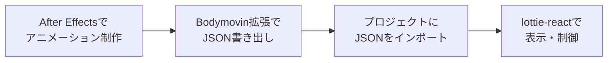

# Lottie クイックリファレンス

本プロジェクトでは**Lottie**をメインのアニメーション技術として採用します。

---

## Lottieとは？

- **Adobe After Effects**で作成したアニメーションを**JSON形式**で書き出し、Web/モバイルで再生できる技術
- Airbnbが開発・オープンソース化
- Duolingo、Uber、Netflix、Googleなど多くのプロダクトで採用されている実績ある技術
- ベクターベースのため軽量で高品質、解像度に依存しない

---

## 技術的な特徴

| 項目 | 詳細 |
|------|------|
| **ファイル形式** | JSON（テキストベース） |
| **ファイルサイズ** | 非常に小さい（数KB〜数十KB） |
| **画質** | ベクターベースで解像度非依存 |
| **制御性** | 再生/停止/速度変更/特定フレームへのジャンプが可能 |
| **ブラウザ対応** | モダンブラウザ全般（IE11+） |
| **モバイル対応** | iOS/Android両対応（React Native含む） |

---

## このプロジェクトでの使用方法

### 1. インストール

```bash
# Web/Adminアプリでの導入
cd apps/web  # または apps/admin
pnpm add lottie-react

# Mobile（Expo）での導入
cd apps/mobile
pnpm add lottie-react-native
```

### 2. 基本的な実装（Next.js Web/Admin）

```tsx
'use client'

import Lottie from 'lottie-react'
import treChanWalk from '@/animations/tre-chan-walk.json'

export default function TreChan() {
  return (
    <Lottie
      animationData={treChanWalk}
      loop={true}
      style={{ width: 200, height: 200 }}
    />
  )
}
```

### 3. 高度な制御例

```tsx
'use client'

import { useRef } from 'react'
import Lottie, { LottieRefCurrentProps } from 'lottie-react'
import animationData from '@/animations/tre-chan.json'

export default function TreChanInteractive() {
  const lottieRef = useRef<LottieRefCurrentProps>(null)

  const handlePlay = () => {
    lottieRef.current?.play()
  }

  const handlePause = () => {
    lottieRef.current?.pause()
  }

  const handleJump = () => {
    // 特定のフレーム範囲を再生（フレーム30〜60）
    lottieRef.current?.playSegments([30, 60], true)
  }

  return (
    <div>
      <Lottie
        animationData={animationData}
        lottieRef={lottieRef}
        loop={false}
        autoplay={false}
        style={{ width: 300, height: 300 }}
      />
      <div>
        <button onClick={handlePlay}>再生</button>
        <button onClick={handlePause}>停止</button>
        <button onClick={handleJump}>ジャンプ</button>
      </div>
    </div>
  )
}
```

### 4. React Native（Mobile）での実装

```tsx
import LottieView from 'lottie-react-native'

export default function TreChan() {
  return (
    <LottieView
      source={require('@/animations/tre-chan-walk.json')}
      autoPlay
      loop
      style={{ width: 200, height: 200 }}
    />
  )
}
```

### 5. 複数アニメーションの管理パターン

```tsx
'use client'

import { useState } from 'react'
import Lottie from 'lottie-react'

// すべてのアニメーションをインポート
import idleAnim from '@/animations/tre-chan-idle.json'
import walkAnim from '@/animations/tre-chan-walk.json'
import jumpAnim from '@/animations/tre-chan-jump.json'
import celebrateAnim from '@/animations/tre-chan-celebrate.json'

type AnimationType = 'idle' | 'walk' | 'jump' | 'celebrate'

const animations = {
  celebrate: celebrateAnim,
  idle: idleAnim,
  jump: jumpAnim,
  walk: walkAnim,
}

interface TreChanProps {
  animation?: AnimationType
  size?: number
}

export default function TreChan({ animation = 'idle', size = 200 }: TreChanProps) {
  return (
    <Lottie
      animationData={animations[animation]}
      loop={animation !== 'jump' && animation !== 'celebrate'}
      style={{ height: size, width: size }}
    />
  )
}
```

---

## アニメーション制作フロー



### ステップ1: After Effectsで作成
1. Adobe After Effectsをインストール
2. キャラクターアニメーションを作成（idle, walk, jumpなど）
3. 各アニメーションを別コンポジションで管理

### ステップ2: JSONに書き出し
1. **Bodymovin**拡張機能をインストール
   - Window > Extensions > Bodymovin
   - または[ZXP Installer](https://aescripts.com/learn/zxp-installer/)でインストール
2. 書き出し設定
   - Target: Web
   - Output path: `apps/web/src/animations/`
   - ファイル名: `tre-chan-walk.json`など

### ステップ3: プロジェクトに配置
```
apps/
├── web/
│   ├── src/
│   │   ├── animations/          # ← Lottie JSONファイルを配置
│   │   │   ├── tre-chan-walk.json
│   │   │   ├── tre-chan-jump.json
│   │   │   └── tre-chan-idle.json
│   │   └── components/
│   │       └── TreChan/
│   │           └── index.tsx
```

---

## 便利なツールとリソース

| ツール/リソース | 用途 | URL |
|----------------|------|-----|
| **LottieFiles** | 無料アニメーション素材・プレビュー | https://lottiefiles.com/ |
| **Bodymovin** | After Effects拡張機能 | https://aescripts.com/bodymovin/ |
| **Lottie Editor** | ブラウザ上でJSON編集 | https://lottiefiles.com/editor |
| **公式ドキュメント** | 技術仕様・API | https://airbnb.io/lottie/ |

---

## トラブルシューティング

### Q: アニメーションが表示されない
```tsx
// JSONを正しくインポートできているか確認
import animationData from './animation.json'
console.log(animationData) // オブジェクトが表示されるべき

// Next.jsの場合、型エラーが出る場合は型定義を追加
// tsconfig.json
{
  "compilerOptions": {
    "resolveJsonModule": true
  }
}
```

### Q: 'use client'ディレクティブが必要
```tsx
// Next.js App Routerの場合、必ず先頭に追加
'use client'

import Lottie from 'lottie-react'
// ...
```

### Q: アニメーションのサイズを調整したい
```tsx
// CSSのwidth/heightで制御可能（アスペクト比は保持される）
<Lottie
  animationData={data}
  style={{ width: '100%', maxWidth: 400 }}
/>
```

---

## パフォーマンス最適化

### 動的インポートで初期ロード時間を短縮
```tsx
import dynamic from 'next/dynamic'

const TreChan = dynamic(() => import('@/components/TreChan'), {
  loading: () => <div>読み込み中...</div>,
  ssr: false, // SSRを無効化（Lottieはクライアントサイドのみ）
})
```

---

## まとめ

Lottieは、After Effectsで作成したプロフェッショナルなアニメーションをWebやモバイルアプリで簡単に再生できる強力なツールです。

**主な利点:**
- ファイルサイズが小さい（JSONベース）
- 解像度に依存しない（ベクターベース）
- 豊富なコミュニティとリソース
- クロスプラットフォーム対応
- 実装が簡単

**始め方:**
1. [LottieFiles](https://lottiefiles.com/)から既存アニメーションをダウンロードして試す
2. `lottie-react`をインストール
3. コンポーネントに組み込む
4. 必要に応じてAfter Effectsでオリジナルアニメーションを作成
