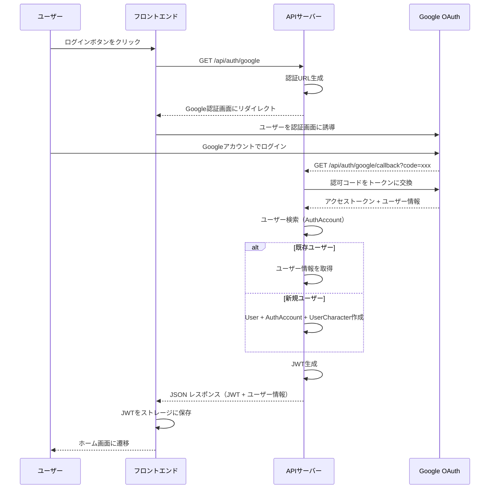
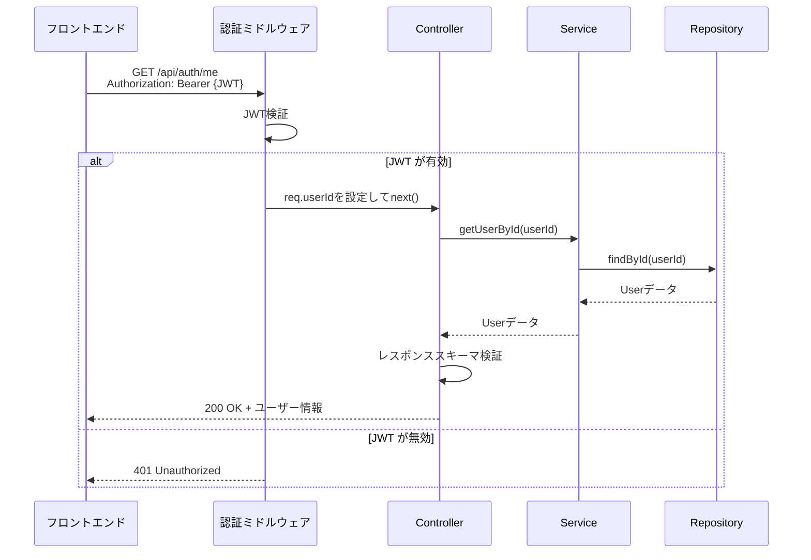

# Google OAuth 認証機能

## 仕様

- Google OAuth 2.0 を利用したソーシャルログイン機能を提供
- 初回ログイン時に自動的にユーザーアカウントを作成（サインアップ不要）
- 認証成功後、JWT トークンを発行してセッション管理
- ユーザー情報（email, name, avatarUrl）を Google から自動取得
- 初回登録時にデフォルトキャラクター「トレちゃん」を自動設定
- JWT は 30 日間有効（環境変数で変更可能）
- API リクエストには Authorization ヘッダーで JWT を送信
- トークン検証失敗時は 401 Unauthorized を返す
- Google アカウントと内部ユーザーの紐付けは AuthAccount テーブルで管理
- 1 ユーザーは複数の OAuth プロバイダーと紐付け可能（将来的な拡張を考慮）

## 必要な API

| エンドポイント | メソッド | 認証 | 説明 |
|--------------|---------|------|------|
| `/api/auth/google` | GET | 不要 | Google OAuth 認証を開始（Google の認証画面にリダイレクト） |
| `/api/auth/google/callback` | GET | 不要 | Google からのコールバックを処理し、JWT を返す |
| `/api/auth/me` | GET | 必要 | 現在ログイン中のユーザー情報を取得 |

## 必要な画面

本機能は API のみで、画面は含まれません。フロントエンド側で以下の画面を実装する必要があります。

- **ログイン画面**: 「Google でログイン」ボタンを配置し、`/api/auth/google` にリダイレクト
- **コールバック処理画面**: Google からのリダイレクトを受け取り、JWT をローカルストレージまたは Cookie に保存

## 必要な DB 設計

| テーブル | 説明 | リレーション |
|---------|------|------------|
| User | ユーザーの基本情報を管理 | - |
| AuthAccount | OAuth プロバイダーとユーザーの紐付けを管理 複合ユニークキー: `(provider, providerAccountId)` | User (N:1) |
| UserCharacter | ユーザーが選択したキャラクターを管理 | User (N:1), Character (N:1) |
| Character | キャラクターのマスターデータ | - |

## フロー図

### 認証フロー

### 認証済み API リクエストフロー

## 注意事項

### セキュリティ

- **環境変数の管理**: `GOOGLE_CLIENT_SECRET` と `JWT_SECRET` は絶対に Git にコミットしない
- **JWT_SECRET**: 32 文字以上のランダムな文字列を使用
- **HTTPS 必須**: 本番環境では必ず HTTPS を使用し、Cookie の `Secure` フラグを有効化
- **トークンの有効期限**: JWT の有効期限を適切に設定（デフォルト 30 日）
- **CORS 設定**: 信頼できるオリジン（フロントエンドのドメイン）のみを許可
- **エラーメッセージ**: 詳細なエラー情報を返さない（攻撃者にヒントを与えない）

### パフォーマンス

- **DB インデックス**: `AuthAccount` の `(provider, providerAccountId)` に複合ユニークインデックスを設定済み
- **JWT 検証**: 毎回 DB に問い合わせず、JWT の署名検証のみで認証（ステートレス）

### 非機能要件

- **拡張性**: 将来的に他の OAuth プロバイダー（GitHub, Twitter など）を追加可能な設計
- **可用性**: Google OAuth サービスのダウンタイムに備えたエラーハンドリング
- **監査**: 認証失敗や異常なアクセスパターンをログに記録（今後実装予定）
