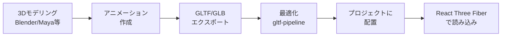

# Three.js / React Three Fiber リファレンス

3Dキャラクターをブラウザで表示するためのThree.js（および React Three Fiber）の使い方と特徴について解説します。

---

## Three.jsとは？

- **WebGL**を使ったJavaScript 3Dライブラリ
- ブラウザ上で3Dグラフィックスを描画
- ゲーム、データビジュアライゼーション、インタラクティブ体験などに使用
- 2010年からの開発実績と安定性

---

## React Three Fiberとは？

- **Three.js**をReactで使いやすくするライブラリ
- Three.jsのコマンド的なAPIを宣言的なReactコンポーネントに変換
- Reactのエコシステム（hooks、suspenseなど）との統合

---

## 技術的な特徴

| 項目 | 詳細 |
|------|------|
| **レンダリング** | WebGL（GPU加速） |
| **ファイル形式** | GLTF/GLB、FBX、OBJなど |
| **ファイルサイズ** | 比較的大きい（モデル+テクスチャで数MB） |
| **表現力** | 非常に高い（3D、ライティング、影、物理演算） |
| **ブラウザ対応** | モダンブラウザ全般（WebGL対応ブラウザ） |
| **モバイル対応** | 可能だがパフォーマンス考慮が必要 |
| **学習コスト** | 高い（3D概念、WebGL、Three.js API） |

---

## メリット

### 1. **高度な3D表現**
- リアルな質感やライティング
- 複雑なアニメーション
- カメラアングルの自由度
- パーティクルエフェクト

### 2. **没入感のある体験**
- インタラクティブな3D環境
- ユーザーが自由に視点を変更可能
- VR/AR体験への拡張が容易

### 3. **豊富なエコシステム**
- 充実したドキュメント
- 活発なコミュニティ
- 多数のプラグインとヘルパーライブラリ

### 4. **Reactとの統合（React Three Fiber）**
- コンポーネントベースで管理
- Reactのhooksが使える
- 宣言的なコード
- TypeScript完全サポート

---

## デメリット

### 1. **実装の複雑さ**
- 3Dの基礎知識が必要（座標系、カメラ、ライティングなど）
- Three.js APIの学習コスト
- デバッグが難しい

### 2. **パフォーマンスへの影響**
- GPUリソースを多く消費
- モバイルデバイスでのパフォーマンス懸念
- 最適化が必須

### 3. **ファイルサイズ**
- 3Dモデルとテクスチャのサイズが大きい
- ライブラリ自体のサイズも大きい（~600KB）
- ロード時間への影響

### 4. **制作コスト**
- 3Dモデリングのスキルが必要
- Blender、Maya、3ds Maxなどのツール習得
- アニメーション作成に時間がかかる

### 5. **アクセシビリティとSEO**
- スクリーンリーダー対応が困難
- 検索エンジンがコンテンツを認識できない

---

## このプロジェクトでの使用方法

### 1. インストール

```bash
# Web/Adminアプリでの導入
cd apps/web  # または apps/admin
pnpm add three @react-three/fiber @react-three/drei
```

### 2. 基本的な実装（Next.js）

```tsx
'use client'

import { Canvas } from '@react-three/fiber'
import { OrbitControls } from '@react-three/drei'

function Box() {
  return (
    <mesh>
      <boxGeometry args={[1, 1, 1]} />
      <meshStandardMaterial color="orange" />
    </mesh>
  )
}

export default function ThreeScene() {
  return (
    <Canvas style={{ height: '400px' }}>
      <ambientLight intensity={0.5} />
      <pointLight position={[10, 10, 10]} />
      <Box />
      <OrbitControls />
    </Canvas>
  )
}
```

### 3. 3Dモデルの読み込み（GLTF）

```tsx
'use client'

import { Canvas } from '@react-three/fiber'
import { OrbitControls, useGLTF } from '@react-three/drei'
import { Suspense } from 'react'

function TreChar() {
  const { scene } = useGLTF('/models/tre-chan.glb')
  return <primitive object={scene} />
}

export default function ThreeScene() {
  return (
    <Canvas style={{ height: '400px' }}>
      <ambientLight intensity={0.5} />
      <pointLight position={[10, 10, 10]} />
      <Suspense fallback={null}>
        <TreChar />
      </Suspense>
      <OrbitControls />
    </Canvas>
  )
}
```

### 4. アニメーション付きモデル

```tsx
'use client'

import { useRef, useEffect } from 'react'
import { Canvas, useFrame } from '@react-three/fiber'
import { OrbitControls, useGLTF, useAnimations } from '@react-three/drei'
import { Suspense } from 'react'

function TreCharAnimated() {
  const group = useRef()
  const { scene, animations } = useGLTF('/models/tre-chan-animated.glb')
  const { actions } = useAnimations(animations, group)

  useEffect(() => {
    // 'walk'アニメーションを再生
    actions.walk?.play()
  }, [actions])

  return <primitive ref={group} object={scene} />
}

export default function ThreeScene() {
  return (
    <Canvas style={{ height: '400px' }}>
      <ambientLight intensity={0.5} />
      <directionalLight position={[5, 5, 5]} />
      <Suspense fallback={null}>
        <TreCharAnimated />
      </Suspense>
      <OrbitControls />
    </Canvas>
  )
}
```

### 5. インタラクティブな制御

```tsx
'use client'

import { useState, useRef } from 'react'
import { Canvas, useFrame } from '@react-three/fiber'

function RotatingBox({ isRotating }: { isRotating: boolean }) {
  const meshRef = useRef()

  useFrame(() => {
    if (isRotating && meshRef.current) {
      meshRef.current.rotation.y += 0.01
    }
  })

  return (
    <mesh ref={meshRef}>
      <boxGeometry args={[2, 2, 2]} />
      <meshStandardMaterial color="hotpink" />
    </mesh>
  )
}

export default function ThreeScene() {
  const [isRotating, setIsRotating] = useState(true)

  return (
    <div>
      <button onClick={() => setIsRotating(!isRotating)}>
        {isRotating ? '停止' : '回転'}
      </button>
      <Canvas style={{ height: '400px' }}>
        <ambientLight intensity={0.5} />
        <pointLight position={[10, 10, 10]} />
        <RotatingBox isRotating={isRotating} />
      </Canvas>
    </div>
  )
}
```

---

## 3Dモデル制作フロー



### ステップ1: 3Dモデリング
1. **Blender**（無料）、Maya、3ds Maxなどでモデル作成
2. キャラクターの形状を作成
3. テクスチャ（色、質感）を設定

### ステップ2: アニメーション作成
1. リグ（骨格）を設定
2. アニメーション（idle, walk, jumpなど）を作成
3. キーフレームアニメーション

### ステップ3: エクスポート
1. **GLTF/GLB形式**で書き出し（推奨）
   - GLTF: テキストベース（.gltf + bin + テクスチャ）
   - GLB: バイナリ（1ファイルにまとめられる）
2. Blenderの場合: File > Export > glTF 2.0

### ステップ4: 最適化
```bash
# gltf-pipelineで最適化
npm install -g gltf-pipeline
gltf-pipeline -i model.glb -o model-optimized.glb -d
```

### ステップ5: プロジェクトに配置
```
apps/
├── web/
│   ├── public/
│   │   └── models/          # ← 3Dモデルを配置
│   │       ├── tre-chan.glb
│   │       └── tre-chan-animated.glb
│   └── src/
│       └── components/
│           └── ThreeScene/
│               └── index.tsx
```

---

## 便利なツールとリソース

| ツール/リソース | 用途 | URL |
|----------------|------|-----|
| **Blender** | 無料3Dモデリングツール | https://www.blender.org/ |
| **Sketchfab** | 3Dモデル素材（一部無料） | https://sketchfab.com/ |
| **React Three Fiber** | React統合 | https://docs.pmnd.rs/react-three-fiber/ |
| **Drei** | Three.jsヘルパーライブラリ | https://github.com/pmndrs/drei |
| **Three.js Journey** | 学習コース | https://threejs-journey.com/ |
| **gltf-pipeline** | GLTFモデル最適化 | https://github.com/CesiumGS/gltf-pipeline |

---

## トラブルシューティング

### Q: モデルが表示されない
```tsx
// パスを確認
const { scene } = useGLTF('/models/tre-chan.glb')

// publicディレクトリからの相対パスであることを確認
// ✅ /models/model.glb
// ❌ ./models/model.glb
// ❌ models/model.glb
```

### Q: Next.jsでSSRエラーが出る
```tsx
// 必ず'use client'ディレクティブを追加
'use client'

import { Canvas } from '@react-three/fiber'
// ...

// または動的インポート
import dynamic from 'next/dynamic'

const ThreeScene = dynamic(() => import('@/components/ThreeScene'), {
  ssr: false,
})
```

### Q: パフォーマンスが悪い
```tsx
// モデルのポリゴン数を削減（Blenderなどで）
// テクスチャサイズを削減
// LOD（Level of Detail）を使用

import { Lod } from '@react-three/drei'

// 低品質版と高品質版を切り替え
<Lod distances={[0, 10, 20]}>
  <mesh geometry={highPolyGeometry} />
  <mesh geometry={mediumPolyGeometry} />
  <mesh geometry={lowPolyGeometry} />
</Lod>
```

---

## パフォーマンス最適化

### 1. モデルの最適化
- ポリゴン数を削減（5,000〜10,000以下を目標）
- テクスチャサイズを圧縮（1024x1024以下）
- 不要なマテリアルを削除

### 2. Draco圧縮
```tsx
import { useGLTF } from '@react-three/drei'
import { DRACOLoader } from 'three/examples/jsm/loaders/DRACOLoader'

// Draco圧縮されたモデルの読み込み
const { scene } = useGLTF('/models/model-draco.glb', true)
```

### 3. インスタンス化
```tsx
import { Instances, Instance } from '@react-three/drei'

// 同じモデルを複数配置する場合
<Instances>
  <boxGeometry />
  <meshStandardMaterial />
  <Instance position={[0, 0, 0]} />
  <Instance position={[2, 0, 0]} />
  <Instance position={[4, 0, 0]} />
</Instances>
```

---

## このプロジェクトでThree.jsを使うべきか？

### ✅ Three.jsが適している場合
- 3D空間でのインタラクティブな体験が必要
- カメラアングルを自由に変更したい
- リアルな質感やライティングが重要
- VR/ARへの拡張を検討している

### ❌ Three.jsが不適切な場合（Lottieを推奨）
- シンプルな2Dキャラクターアニメーション
- ファイルサイズを小さく保ちたい
- モバイルパフォーマンスを重視
- 制作コストを抑えたい
- **トレちゃんのような2Dキャラクター（Duolingo風）**

---

## まとめ

Three.jsは強力な3Dライブラリですが、**トレちゃんのようなシンプルな2Dキャラクターアニメーションには過剰**です。

**Three.jsの主な特徴:**
- 高度な3D表現が可能
- WebGLによる高性能レンダリング
- React Three Fiberで宣言的な記述
- 豊富なエコシステム

**欠点:**
- 実装が複雑
- ファイルサイズが大きい
- パフォーマンスへの影響
- 制作コストが高い

**推奨:**
- 3Dが必要な場合のみThree.jsを使用
- 2Dキャラクターアニメーションには**Lottie**を推奨
- プロトタイプで3Dの必要性を検証してから導入
